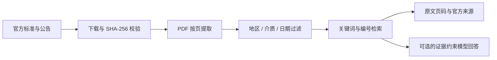

# 环规 Environment Agent

面向环境从业者的区域标准知识库与可追溯问答原型。项目把北京、上海、浙江、江苏的水与水样、土壤、气体规范整理为统一目录，并按地区、介质、适用日期和标准版本过滤检索结果。

[在线演示](https://huanguizj-water.jasonhsia1023.chatgpt.site) · [产品与数据说明](PROJECT.md)

> 演示站点目前需要登录访问。结果仅用于快速定位规范依据，不能代替项目合规审核、排污许可证或官方原文。

## 为什么做这个项目

环境行业标准数量多、发布主体分散、版本更新快。同一问题往往同时涉及国家标准、地方标准、行业要求和项目许可证。本项目重点解决三个问题：

- 按地区和介质快速缩小标准范围；
- 根据实施与替代日期排除尚未生效或已被替代的版本；
- 每条结果保留官方来源、PDF 物理页码和证据原文，方便人工复核。

## 当前能力

- **四地知识库**：北京、上海、浙江、江苏。
- **三类入口**：水与水样、土壤、气体。
- **版本过滤**：根据查询日期判断已实施、尚未实施和已替代状态。
- **证据检索**：按标准编号、环境术语、中文双字组和场景边界加权召回。
- **区域继承**：全国标准自动适用于四地，地方标准只进入对应地区，跨地区标准只保存一份。
- **可选模型回答**：接入通义千问或 DeepSeek 后，仅基于召回证据生成带引用回答；未配置密钥时使用确定性原文检索。
- **来源追踪**：保存官方链接、PDF 指纹、查询记录、用户反馈和人工核验记录。

当前知识库包含 **34 条文件与版本记录、28 份官方 PDF 全文、636 个带页码证据片段**。

| 地区 | 水与水样 | 土壤 | 气体 |
| --- | ---: | ---: | ---: |
| 北京 | 12 | 4 | 9 |
| 上海 | 12 | 3 | 9 |
| 浙江 | 12 | 3 | 9 |
| 江苏 | 11 | 3 | 9 |

计数包含该地区可用的全国通用规范。完整清单与资料边界见 [PROJECT.md](PROJECT.md)。

## 工作流程



## 技术栈

- React 19、TypeScript、Vinext
- Cloudflare Workers、D1
- Python、pypdf
- 可选的 OpenAI 兼容模型接口

## 本地运行

需要 Node.js 22.13 或更高版本。重新生成知识库时还需要 Python 和 `pypdf`。

```powershell
npm ci
npm run build
node --import ./scripts/sites-env.mjs ./node_modules/wrangler/bin/wrangler.js d1 execute DB --local --config dist/server/wrangler.json --persist-to .wrangler/state --file drizzle/0000_slippery_lorna_dane.sql
npm run dev
```

数据库迁移只需在全新的本地 D1 数据库执行一次，然后打开开发服务器输出的本地地址。

## 配置模型

项目不包含任何 API 密钥。复制 `.dev.vars.example` 为 `.dev.vars`，只在本机填写：

```dotenv
AI_BASE_URL=https://dashscope.aliyuncs.com/compatible-mode/v1
AI_MODEL=qwen-plus
AI_API_KEY=your_key_here
```

也可以使用 `https://api.deepseek.com/v1` 和 `deepseek-chat`。服务端只允许这两个 HTTPS 主机，浏览器不会读取或保存密钥。调用模型时，问题和公开标准片段会发送给所选服务商。

## 重新生成知识库

```powershell
python -m pip install pypdf
python scripts/ingest.py
```

数据源定义在 `scripts/ingest.py`。脚本下载公开文件、计算 SHA-256、提取页面文本并重建 `data/knowledge.json`。标准状态、实施日期、替代关系和 PDF 表格仍需人工核对。

## 验证

```powershell
npm exec -- tsx scripts/verify.ts
npm exec -- tsc --noEmit
npm run build
```

接口验证需要先运行开发服务器：

```powershell
node scripts/verify-api.mjs
```

测试覆盖日期边界、版本替代、全国标准继承、跨地区标准、介质分类、检索结果、身份校验、请求来源校验和数据持久化。它们不等同于行业问答准确率评测。

## 主要目录

```text
app/                 页面与服务端 API
data/knowledge.json  可复现的知识库快照
lib/                 检索、版本判断与数据库访问
public/documents/    官方公开 PDF
scripts/             入库、构建与验证脚本
drizzle/             D1 数据库迁移
```

## 安全与隐私

- `.env*`、`.dev.vars*`、本地数据库、构建目录和运行状态默认不进入版本控制；仓库只保留空值示例配置。
- 模型密钥仅在服务端读取，模型地址经过 HTTPS 主机白名单校验。
- API 要求登录身份，写请求检查来源，查询与反馈按用户隔离。
- 知识库中的 PDF 来自公开官方来源；使用时仍应核对发布机关的最新原文。

发现安全问题请参阅 [SECURITY.md](SECURITY.md)，不要在公开 Issue 中提交密钥或个人数据。

## 项目边界

当前不是全量法规数据库，也不会自动判定项目是否合规。尚未完整覆盖市县政策、所有行业排放限值、项目环评批复和排污许可证；自动提取的 PDF 表格可能丢失行列关系，应打开原始 PDF 核对。
